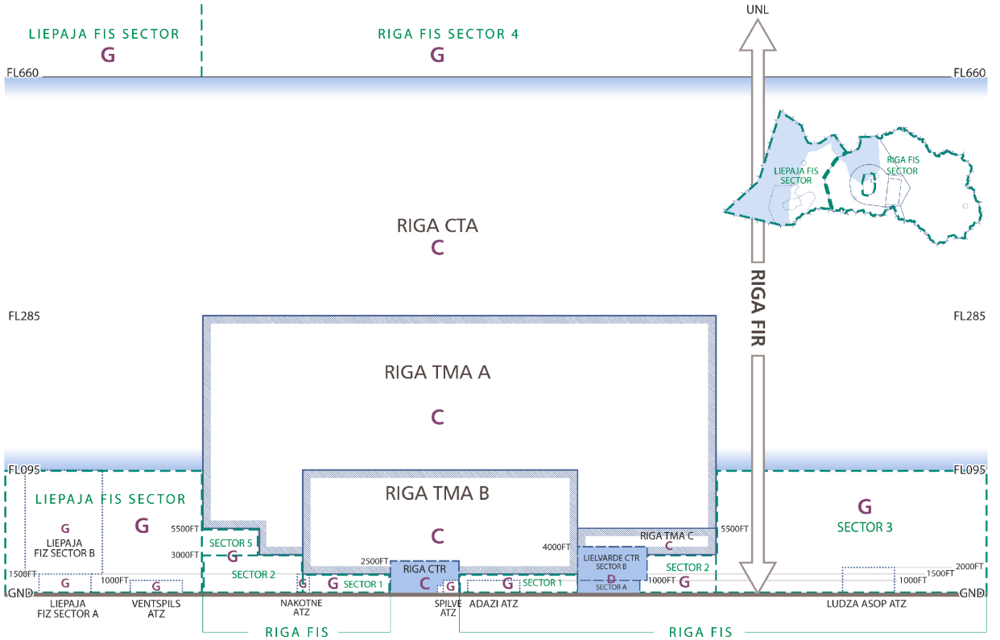

# Airspace Structure

Some parts of airspace serve different purposes bases on their limits and proximity to an airfield and other important features on the ground. This page goes over the typical airspaces that one might encounter while flying or controlling in Latvia as well as Europe in general.

## ATS Airspace Classification and Structure in EVRR FIR

## Controlled Airspace

### Control Traffic Zone (CTR)

Control Traffic Zones (CTRs) are a type of airspace that is used around controlled aerodromes. Typically such an airspace extends from the ground (SFC) to a rather low vertical limit (e.g. Riga CTR has vertical limits of `SFC-2500FT`). The lateral limits of a CTR are also not very large: a typical CTR extends approximately 10-15 NM around a given aerodrome. This airspace is staffed by an ATCO with an endorsement to control the Tower (position). A CTR is the first airspace that a departing aircraft crosses once airborne, and the last airspace that an arriving aircraft goes through before touchdown. Such airspaces may be either fully controlled or procedural.

EVRR FIR has 2 CTRs: Riga CTR and Lielvarde CTR. Precise dimensions and additional information on the structure and characteristics of those airspaces is available in the AIP of the Republic of Latvia section `EVGA AD 2.17 AIR TRAFFIC SERVICES AIRSPACE`.

#### Riga CTR

Riga CTR is as class C airspace that has vertical limits of `SFC-2500FT` and covers the RIX Riga Airport (formerly Riga International Airport). The CTR is of an irregular shape to accommodate for noise abatement practices in a large city (by Latvian standards) such as Riga, as well as to make space for the Aerodrome Traffic Zone (ATZ) of Spilve Airfield. Riga CTR is staffed by Riga Tower.

#### Lielvarde CTR

Lielvarde CTR is a class D airspace that is split into sectors A and B which have vertical limits of `SFC-1000FT` and `1000FT-4000FT` respectively. This CTR covers the Lielvarde military base and is also an irregular polygon. 3 sides of it are perpendicular to each other and 1 follows the border of Riga Terminal Maneuvering Area (TMA) Sector B. This CTR is not permanent and may be deactivated at any time (Republic of Latvia AIP EVGA AD 2.17). Lielvarde CTR is staffed by Lielvarde Tower.

### Terminal Maneuvering Area (TMA)

Terminal Maneuvering Areas are another type of airspace directly associated with an aerodrome. Typically this is a portion of airspace specifically allocated for handling separation among aircraft that are continuously climbing/descending, i.e. those that have just departed or are about to arrive. TMAs are often split into sectors that may be staffed by different ATCOs to accommodate for large traffic volumes. Same as a CTR, a TMA may be procedural. An ATCO responsible for a non-procedural TMA or its section holds an Approach Control Surveillance (APS) endorsement, thus an ATC station responsible for a TMA typically holds callsign of "Approach" or "Departure".

EVRR FIR has only 1 TMA - Riga TMA. This TMA is attached to and associated with the RIX Riga Airport. Riga TMA is class C airspace that is atypically large compared to other European TMAs, it spans more than 120 nautical miles. The TMA is split into 3 sectors: A, B, and C with respective vertical limits of `3000FT-FL285`, `1500FT-FL95`, and `3000FT-5500FT`. Riga TMA is staffed by Riga Approach and has 2 staffing configurations: a combined Riga Approach covering sectors A, B, and C on frequency 129.925MHz, or a 2-sector split with sectors A and C being covered by frequency 129.925MHz and sector B being covered by frequency 134.850MHz.

### Control Area (CTA)

## Uncontrolled Airspace

### Aerodrome Traffic Zone (ATZ)

#### Transponder Mandatory Zone (TMZ)

#### Radio Mandatory Zone (RMZ)
