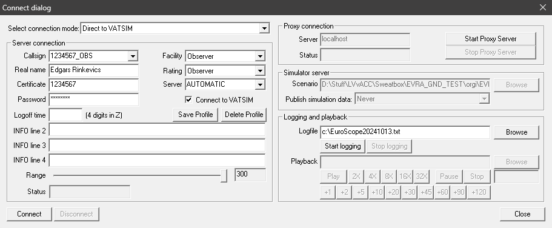

import { Steps, Callout } from "nextra/components";
import { ArrowDownToLineIcon, ExternalLinkIcon } from "lucide-react";
import themeConfig from "theme.config";

# EuroScope Guide

EuroScope is an ATC client that has been in active use on VATSIM since 2006. It is one of the most advanced tools currently available for virtual air traffic controlling, so much so that it has even found use in training real-life ATC trainees in some countries.

Latvia vACC uses exclusively EuroScope for controlling within EVRR FIR.

## Installation of EuroScope and EVRR FIR Sector File

The specific setup that is used for controlling in EVRR FIR comes in 2 parts: EuroScope itself and the EVRR FIR sector file. From here on EuroScope will often be referred to as <abbr title="EuroScope">ES</abbr>.

### EuroScope

<Steps>

<h4>Download EuroScope</h4>

It is recommended that you use <u>EuroScope v3.2.3.2</u> for greatest compatibility with plugins and other parts that interface with ES. You can download the installer for the aforementioned ES version by clicking the button below.

[<button className="flex h-10 remove-parent-underline items-center gap-1 rounded-md bg-latvia-carmine px-3 py-2 font-medium text-white no-underline transition-colors hover:bg-latvia-carmine/90"><ArrowDownToLineIcon size={18}/>Download EuroScope</button>](https://euroscope.hu/install/EuroScopeSetup.3.2.3.2.msi)

Additional information about ES and version history is available at [euroscope.hu](https://euroscope.hu).

<h4>Use the installation wizard</h4>

The wizard is really simple: just press "next"/"install" until the installation is completed!

</Steps>

<Callout type="error" emoji="⚠️">
  Please, remember, write down, or know how to find later the file system path
  where you have installed EuroScope. Knowing this path will aid in installing
  updates and solving some edge-case problems that you might encounter in the
  future while using ES.
</Callout>

<Callout>
  It is recommended not to open ES straight away after completing the
  installation process. Doing this will lead to the sector file for Hungary that
  is included by default. It is not used by Latvia vACC.
</Callout>

If you would like to take a deeper dive into ES and its features that are beyond this guide, please refer to [EuroScope Documentation](https://www.euroscope.hu/wp/quick-start/).

### EVRR FIR Sector File

<Steps>

<h4>Download the sector file</h4>

You can always find the latest version of the sector file on **AeroNav GNG**, the common platform for many sector files on VATSIM.

**Remember, it is your responsibility to always use an up-to-date version of the sector file.** Whenever updates are released for the EVRR FIR sector file, appropriate announcements are made on AeroNav GNG, on the [vACC Discord server](https://discord.gg/rr5dpuh), and on other official vACC mediums.

[<button className="flex h-10 remove-parent-underline items-center gap-1 rounded-md bg-latvia-carmine px-3 py-2 font-medium text-white no-underline transition-colors hover:bg-latvia-carmine/90"><ExternalLinkIcon size={18}/>Download EVRR FIR Sector File</button>](https://www.files.aero-nav.com/EVRR)

<Callout>
  If you are downloading the sector file for the first time or installing it on
  a new system, download **`Sector_Package_Final`**. To update an existing
  installed instance of the sector file, download **`Sector_Package_Update`**.
</Callout>

<h4>Extract the contents of the archive</h4>

This can be done anywhere on your PC, but you should **remember or write down the path where you extracted the sector file**, since you will need it to launch ES itself, update and customise plugins and settings, and many other things.

<h4>Launch EuroScope</h4>

Launch ES directly by running the executable from the folder where you installed it or by using the desktop shortcut that the installation wizard has most likely generated for you. You will be greeted with the ES launch banner and a file-selection dialog; find the path where you previously extracted the sector file and select `EVRR.prf`.

</Steps>

### Starting Tips

Here are a few tips for your first steps in EuroScope:

- Try cycling through different views, there are separate views for <abbr title="Ground Movement Control">GMC</abbr>, <abbr title="Tower Control">TWR</abbr>, and radar control. They can be accessed by pressing <kbd>`F1`</kbd> and then numbers `1` through `3`. Note: the keys should be pressed sequentially and not simultaneously.
- Try looking through settings and various lists that ES has to offer to understand everything better. You are free to ask questions to training staff if you are feeling lost or cannot figure something out.
- Furthermore, you are free to experiment, however, **remember to back-up the sector file before making any changes** as most modifications to the sector file can render it unrealistic or incomplete in features that are needed for controlling.

## Basic Usage Guide

This section will go over some of the "most useful buttons and commands" if they can be called that. Please note that this part of the knowledgebase is in no way an exhaustive guide to using EuroScope. If you are an ATC student in Latvia vACC, you will be gradually introduced to most ES functions by your assigned mentor.

### Observing on VATSIM

According to the [VATSIM Code of Conduct section A2(a)](https://vats.im/coc#a-general-rules-of-conduct) members may participate in network activities by observing, flying, or controlling. Observing can help a new member learn the basics of radio-communication and procedures at their airport of choice. It is possible to observe network activities both through pilot clients such as vPilot or xPilot and through ATC clients such as EuroScope.

When you launch ES for the first time you might see something like the image below. If something is different in your case, do not worry, there is a possibility that you have a different view open (see [Starting Tips](#starting-tips)) or have some settings or plugins set up differently by default. As long as the things you are seeing do not look completely broken and you are not getting any warnings, everything should be fine.

If is recommended that you open the <abbr title="Ground Movement Control">GMC</abbr> view for an optimal observing experience if you are a new ATC trainee. This can be done by pressing <kbd>`F1`</kbd> and <kbd>`3`</kbd> in sequence.

Now it is easy to start observing by following these simple steps:

<Steps>

<h4>Click "CONNECT" on the green ribbon on the top of your screen</h4>

<h4>Fill out your details in the dialog window that popped-up</h4>

Make sure to follow the following rules when making an observer connection to VATSIM:

- Your callsign must be compliant with [VATSIM Code of Conduct section C3](https://vats.im/coc#c-controller-conduct).
- Your name must be compliant with [VATSIM Code of Conduct section A4 and A12](https://vats.im/coc#a-general-rules-of-conduct).
- Your "certificate" shall match your VATSIM-issued <abbr title="Certificate Identifier">CID</abbr>.
- You shall enter your VATSIM password in the "password" field.
- Your "facility" shall be `Observer`.
- Your "rating" shall match your current VATSIM rating (can be checked on [my.vatsim.net](https://my.vatsim.net)) unless you currently hold an administrative rating. Administrative rating holders shall follow rules outlined in [VATSIM Europe Division Policy section 5.2](https://core.vateud.net/division/policies).
- Your "server" shall be `AUTOMATIC`.
- All other fields shall maintain their default states. They need not to be changed in any way.

<h4>Click "Connect" in the bottom-left corner</h4>

Note: there will be a pop-up asking for you to fill out your expected logoff time. You may ignore it and proceed without entering any value in that field.

**Congratulations!** You are now online as an observer on VATSIM! Now you can view and follow ATC operations in EVRR FIR. The only thing left is to select the frequencies that you wish to listen to. Text frequencies can be selected from within ES and the next step covers their selection, though voice frequencies require additional software known as Audio for VATSIM or AFV. A detailed guide on using the 2 most popular AFV clients is available on [the next page of the knowledgebase](./afv).

<h4>Select text frequencies that you would like to follow</h4>

Click the "headphones" button on the ES top green ribbon.

The following dialog window should pop-up:

Click the `RCV TXT` checkbox next to the frequencies you would like to follow. Voila!

</Steps>

### Basic Commands

The following commands might be most useful to you as an aspiring ATCO on VATSIM:

- `.QD [ICAO]` (shortcut <kbd>`F2`</kbd>) adds a METAR of an airport of your choice to the METAR list.
- `.contactme`[\*](#only-active-atco) (shortcut <kbd>`HOME`</kbd>) sends a `Please contact me on [frequency]MHz` message to the selected aircraft. Note: this command does not require a callsign, the message will be sent to the currently selected aircraft if there is one, otherwise to the aircraft first selected after typing in or using the shortcut for the command.
- `.inf [callsign]` provides you information on the chosen member's connection client and their current active primary frequency.
- `.SS [aircraft callsign]` (shortcut <kbd>`F6`</kbd>) provides information on the given aircraft's flight plan details and aircraft type in the bottom black section of ES.
- `.chat [callsign]` opens a text chat with the desired member.
- `.wallop [description of the situation]`[\*](#only-active-atco) (shortcut <kbd>`HOME`</kbd>) calls a supervisor. This command should be used in case you have any issues or questions regarding other members of the network in the vicinity of you or your airspace. Please provide an accurate and detailed description of the situation you are facing. Here are a few example situations when you may find this command useful as an ATCO:
  - When a pilot does not come onto your frequency after several uses of the `.contactme` command.
  - When a pilot violates their clearance limit and/or does something that they were not cleared for and does not stop doing so after you ask them to follow your instructions.
  - When someone violates the VATSIM Code of Conduct, Code of Regulations, User Agreement, Global Controller Administration Policy or any other network or division policy that they were supposed to follow.
  - When someone disrupts the frequency.

  \* This command shall only be used by
  non-observer members (i.e. pilots or ATCOs). In case of the wallop command the
  former applies unless the issue directly affects the observer's experience on
  the network.

