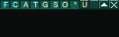
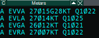
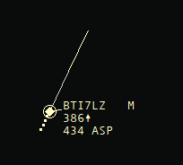

import { FileTree } from "nextra/components";

# EuroScope Extended Guide

This page contains short explainers to some ES functions that are not in day-to-day use of an average ATCO, but are still rather useful. This list is by no means exhaustive since it is the job of vACC ATC Training Department staff to introduce trainees to the use of [required software](/software-guides#required-software); however, if you believe that certain ES features should be covered on this page, feel free to submit feedback on [GitHub](https://github.com/Latvia-vACC/Knowledgebase/issues/new?title=Feedback%20for%20%E2%80%9CEuroScope%20Extended%20Guide%E2%80%9D&labels=feedback,enhancement).

## EuroScope Settings

EuroScope configuration and settings are defined separately for each sector file and can be defined through either `.txt` files or EuroScope's UI. The settings files specific to the EVRR FIR sector file can be accessed at `[EVRR FIR Sector File Folder]/EVRR/Settings` and the contents of those folders are as follows.

<FileTree>
  <FileTree.Folder name="EVRR" defaultOpen>
    <FileTree.Folder name="Settings" defaultOpen>
      <FileTree.File name="ACC_APP-General.txt" />
      <FileTree.File name="ACC_APP-Tags.txt" />
      <FileTree.File name="Lists.txt" />
      <FileTree.File name="LoginProfiles.txt" />
      <FileTree.File name="Plugins.txt" />
      <FileTree.File name="Screen.txt" />
      <FileTree.File name="Symbology.txt" />
      <FileTree.File name="VoiceChannels.txt" />
    </FileTree.Folder>
  </FileTree.Folder>
</FileTree>

Due to a rather unique way that ES is built, the `.txt` files contain many more options than can be edited in EuroScope's UI. Normally, there should be no need to edit ES settings directly (i.e. not through a sector file version update), but it is good to know how it is done just in case. In EuroScope's UI settings are available through the `OTHER SET` button on the top green ribbon. The different settings sections largely mean exactly what is written.

While there is no point going over every setting in this guide, an exhaustive description of all ES features is available in [EuroScope Documentation](https://www.euroscope.hu/wp/quick-start/).

## EuroScope Lists

Lists are an essential part of ES that every controller works with on a daily basis -- they are useful for non-verbal coordination with other controllers and keeping track of things that happen on the screen without having to memorise everything. Although all lists are structured differently and serve different purposes, they all have some features in common.

1. The visibility of each individual list can be configured through the `QUICK SET` button on the top green ribbon.

2. All lists' length and contents can be customised by pressing buttons the top-left corner of any given list.
   - The most left button allows for changing the list's length.
   - The `F` button allows for selection of columns to be visible or not.
   - The `S` button allows for complete customisation of a given list's contents.

*>img]:w-[68px]">
  

### Departure List

The primary way that GMC and TWR ATCOs interface with EuroScope is through the departure list. It contains all aircraft that are currently on the ground and have filed a flight plan originating from the airport they are currently at. An example of how a departure list looks is available below.

In general it is possible to check if a given row of the departure list is set up correctly by verifying its compliance with the following requirements:

- The aircraft's status (STS) is equal to its clearance limit.
- The aircraft has received/is to receive appropriate departure instructions (SID, etc.) based on their flight rule.
- The aircraft's cleared flight level (CFL) is set to 4000ft for IFR traffic, unless otherwise coordinated, and 1500ft for VFR traffic, unless otherwise coordinated.
- The aircraft has a valid squawk code assigned (ASSR) based on its destination (international/domestic).
- The flight plan has a valid route and a correct requested flight level (RFL) for their direction of flight.

### Arrival List

The arrival list shows all aircraft that are within a certain distance of an airport as well as those that have already arrived. It also contains a text field designated for notes, remarks, and/or stand assignment. The arrival list has been largely made redundant with the introduction of the [Ground Radar Plugin](./plugins#ground-radar-plugin).

### Sector Inbound List

The sector inbound list (often shortened to <abbr title="Sector Inbound List">SIL</abbr>) shows all traffic that is "concerned" for the controller in question. Traffic is given the "concerned" state if it is not on the ground and falls into one of 3 categories:

- The traffic's flight plan crosses or is tangent to a part of the airspace that is within the AoR of the controller in question.
- The traffic's trajectory is such that they shall cross (either lawfully or unlawfully) the border of the given controller's AoR.
- The traffic is currently within the controller's AoR, but the controller has not yet assumed responsibility over its TAG.

The SIL can be used for non-verbal coordination with other controllers by requesting a non-default Coordinated Point of Entry (COPN) or Planned Entry Level (PEL). Such a request can be created by clicking <kbd>`LMB`</kbd> on the value of interest and inputting a new one.

In addition to its capacity for coordination the SIL acts as a source of TAG information for aircraft not in the vicinity of the given controller's AoR. The availability of such information is crucial for pre-planning and workload management.

### Sector Exit List

The sector exit list (often shortened to <abbr title="Sector Exit List">SEL</abbr>) shows all traffic over which the controller in question has assumed responsibility.

Since SEL displays aircraft that are in most cases already in the controller's AoR, its function is pretty much opposite that of the SIL's. SEL facilitates non-verbal coordination by allowing controllers to interface with the Coordinated Point of Exit (COPX) and Planned Exit Level (XFL). A request for those values to deviate from default within some other controller's AoR can be made by clicking <kbd>`LMB`</kbd> on the value of interest and inputting a new one. Furthermore, it is possible to select the next expected ATS provider for a given aircraft in the SEL by editing the SI column.

### Controller List

The controller list displays controllers that are within the range of the controller viewing the list. The list can be configured and filtered by pressing buttons in the green ribbon defining the list.

Below are some notable features of the controller list:

- Controller IDs are displayed next to controller callsigns; they can be used in aliases such as `.cont`.
- Double clicking on a given controller opens a chat with the controller in the bottom sections of ES.
- Right clicking on a given controller gives the option to call them on VCCS (the internal ES TeamSpeak server, deprecated) or see their controller information (ATIS).

### METAR List

The METAR list's purpose is right in its title: it displays METARs of the airfields that the controller chooses. Depending on ES configuration (can be changed in `OTHER SET -> General Settings`) the list will display all "active" airfields (i.e. those within the given controller's AoR) and update them dynamically or display only those that the controller manually adds to the list.

Airfields' METARs can be manually added to the list by using the `.QD [ICAO]` command (shortcut <kbd>`F2`</kbd>).

## Airspace Management Tools

### Flight Plan Creation

Although rare, sometimes a flight plan needs to be created for a pilot instead of them filing it on the network. Since ATCOs are not airline operations staff, no controller is expected to file full-fletched IFR flight plans, however, this functionality is still used to create basic flight plans for VFR pilots.

Aircraft without a flight plan do not show up in any list except for the "Flight Plan List", therefore there are 2 ways of accessing the flight plan dialog of such an aircraft.

- Option 1: find the aircraft in the "Flight Plan List" and click on it (such an aircraft will always be marked with `NOFP`).
- Option 2: "assume" the TAG of the aircraft and open the flight plan dialog from the [Sector Exit List](#sector-exit-list).

To create a flight plan, the following fields must always be filled out before pressing <kbd>`OK`</kbd>:

- Altitude (i.e. RFL)
- Departure airfield
- Destination airfield

It is also preferred that the squawk and CFL be filled out as well for the sake of convenience.

 
<u>
  Note: A flight plan created in such a way is **NOT** visible to adjacent
  ATCOs.
</u>

### Leader Lines

Leader lines are an essential tool for pre-planning and ensuring lateral separation between aircraft. The screenshot below shows an example of a 2-minute leader line.

Leader lines show the hypothetical position of a given aircraft in the future, assuming said aircraft maintains its present heading. Leader lines can be configured by time (in minutes) and by distance (in NM). Time-based leader lines are calculated accounting for the current ground speed (GS) of the aircraft. Distance-based leader lines are static. Leader line settings are available on the ES top green ribbon and look as shown in the screenshot below.

### Altitude Filter

Another function of EuroScope that is useful for decluttering the current active view is the altitude filter. It is rather obvious that a GMC controller need not to see aircraft at FL370, therefore an altitude filter is set up in the range `GND-040` on the ES top green ribbon.

The default setting for the radar view on the other hand is `002-UNL`.

Said button is clickable and opens the display settings dialog. The available options in that dialog are rather straight forward and the settings for configuring the altitude filter are at the top of said dialog.

### Measure Tool

### Distance Tool

### Separation Tool

### Flight Plan Separation Tool
