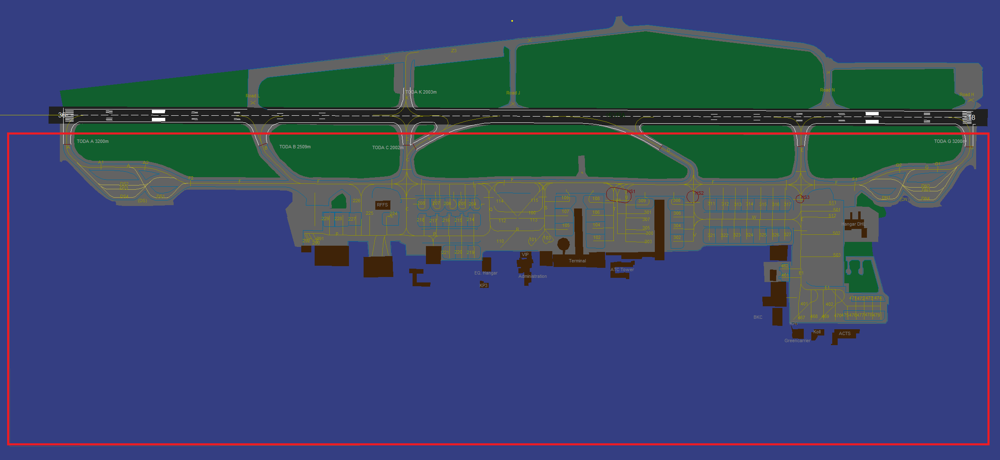

# GMC SOP

This collection of Standard Operating Procedures is dedicated to Ground Movement Control and contains both procedure descriptions and relevant phraseology. All SOPs in this Knowledgebase are structured in the same way for ease of use and accessibility purposes.

## Supporting Documentation

- [ICAO Doc 4444 - Air Traffic Management](/assets/icao-doc-4444-air-traffic-management.pdf) (Chapters 4, 7, and 10-12)
- [Republic of Latvia AIP](https://ais.lgs.lv) (Sections EVRA AD 2.1 through 2.25)

## Relevant Positions and Airspace

|        Callsign        |     Frequency     |       AoR        |         Lateral Limits         | Vertical Limits | Airspace Class |
| :--------------------: | :---------------: | :--------------: | :----------------------------: | :-------------: | :------------: |
| Riga Ground (EVRA_GND) | 118.805 (118.800) | RIX Rīga Airport | **EAST** of the runway at EVRA |       N/A       |      NIL       |

### Visual Representation of the AoR

Below the AoR of EVRA GMC is shown; Rīga Ground is the only GMC position in EVRR FIR.

## Responsibility and Required Knowledge

In general, aspiring GMC controllers are questioned and monitored on their ability to the following responsibilities and knowledge points.

### Responsibility

- To validate flight plans and issue departure clearances.
- To monitor ground movement and ensure safe operations (incl. all types of ground maneuvers).
- To coordinate departure flow with stations above.
- To accommodate pilots' information and/or procedure requests.
- To observe and enforce local and ICAO rules and regulations for ground movement.

### Required Knowledge

- Flight plan validation rules (incl. the semicircular rule).
- Differences among aircraft types and wake turbulence categories.
- Spacing requirements and availability on the apron.
- Priority rules.
- Taxi route composition rules.
- Ability to apply and enforce low visibility procedures.
- Ability for basic coordination with higher ATC stations.
- Basic understanding of VFR handling.
- Ability to read METAR, TAF, NOTAMs, and other relevant information formats used in aviation.
- Phraseology relevant to GMC operations.
