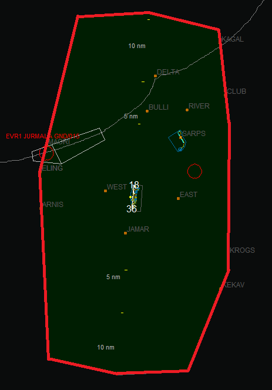
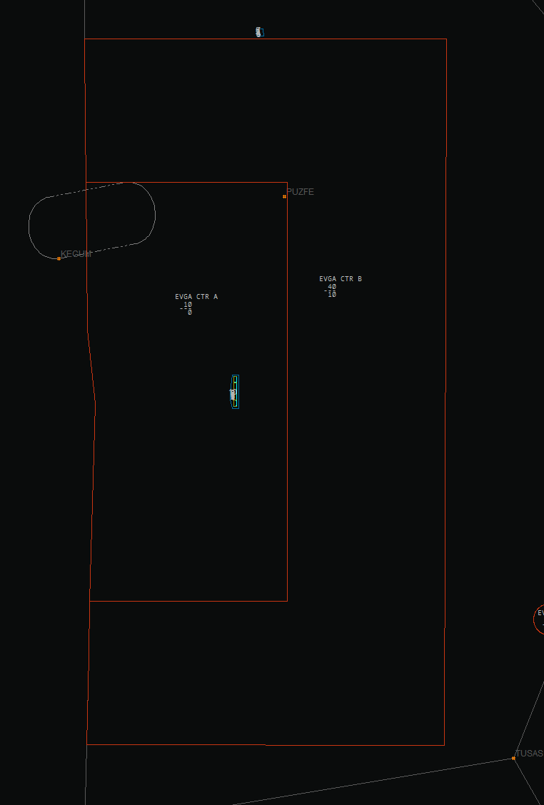

# TWR SOP

This collection of Standard Operating Procedures is dedicated to Tower Control and contains both procedure descriptions and relevant phraseology. All SOPs in this Knowledgebase are structured in the same way for ease of use and accessibility purposes.

## Supporting Documentation

- [ICAO Doc 4444 - Air Traffic Management](/assets/icao-doc-4444-air-traffic-management.pdf) (Chapters 4-7, and 10-12)
- [Republic of Latvia AIP](https://ais.lgs.lv) (Sections ENR 1.6, ENR 5., and EVRA AD 2.1 through 2.25)

## Relevant Positions and Airspace

|                                                 Callsign                                                 |     Frequency     |      AoR      |                  Lateral Limits                   |                 Vertical Limits                  | Airspace Class |
| :------------------------------------------------------------------------------------------------------: | :---------------: | :-----------: | :-----------------------------------------------: | :----------------------------------------------: | :------------: |
|                                          Riga Tower (EVRA_TWR)                                           | 118.105 (118.100) |   Riga CTR    | As defined in Republic of Latvia AIP EVRA AD 2.17 |                    SFC-2500FT                    |       C        |
| Lielvarde Tower (EVGA_TWR)[\*](#lielvarde) | 118.155 (118.150) | Lielvarde CTR | As defined in Republic of Latvia AIP EVGA AD 2.17 | Sector A: SFC-1000FT Sector B: 1000FT-4000FT |       D        |

  \* Lielvārde is a military airfield and
  as such is not a training airfield in Latvia vACC. Real life ATCOs at LGS also
  do not go through any training at Lielvārde airbase and are trained
  exclusively at Rīga. Therefore this SOP will exclusively focus on procedures
  followed and phraseology used by Riga Tower.

### Visual Representation of the AoR

#### Riga Tower

Below the AoR of EVRA TWR is shown. Riga CTR is highlighted in red.

#### Lielvarde Tower

Below the AoR of EVGA TWR is shown. Lielvarde CTR is highlighted in red. The CTR is split into 2 laterally overlapping sectors, A and B.

## Responsibility and Required Knowledge

In general, aspiring TWR controllers are questioned and monitored on their ability to the following responsibilities and knowledge points.

### Responsibility

- To select the correct runway-in-use.
- To apply WTC-based separation and issue takeoff and landing clearances.
- To monitor the runway as well as the whole CTR and ensure safe operations.
- To ensure minimum practicable runway occupancy over time.
- To coordinate spacing and departure flow with neighbouring ATS units.
- To provide flight information service (incl. traffic information) to VFR aircraft inside controlled airspace.
- To issue missed approach instructions when needed.
- To accommodate pilots' information and/or procedure requests.
- To observe and enforce local and ICAO rules and regulations for aerodrome movement and runway operations.

### Required Knowledge

- WTC-based departure/arrival spacing rules.
- In-depth understanding of runway operations including application of reduced runway separation minima.
- Tactical application of priority rules.
- Basic understanding of different types of instrumental and non-instrumental approach procedures.
- Ability for multi-directional coordination with neighbouring ATS units.
- Advanced understanding of VFR procedures and FIS provision in controlled airspace.
- Ability to apply and enforce low visibility procedures.
- Ability to execute the duties of TWR and GMC as a combined ATS unit.
- Advanced frequency management ability.
- Phraseology relevant to TWR operations.
