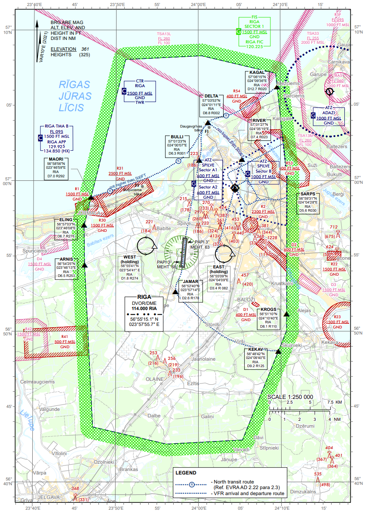

# TWR SOP – Procedures

## Basic Procedures

### Airspace Overview

The AoR of Riga Tower is defined by Riga CTR – a portion of controlled airspace lateral limits defined in Republic of Latvia AIP [EVRA AD 2.17.1](https://ais.lgs.lv). and vertical limits of SFC-2500FT AMSL. Riga CTR is designated as class C controlled airspace. For the purposes of this Knowledgebase as well as on frequency, Riga CTR will always be referred to as simply "controlled airspace". A graphical representation of Riga CTR is shown below.

  

<em>Source: Latvijas Gaisa Satiksme; AIP EVRA AD 2.24.14 - 1</em>

Riga CTR contains 2 airports within its lateral limits: RIX Riga Airport and Spilve Airfield with the former being the primary responsibility of Riga Tower and the latter being uncontrolled. Parts of Riga CTR are designated as permanently restricted airspace. No traffic is permitted to enter these sections of airspace barring emergency situations. Riga Tower ir primarily responsible for ensuring non-infringement of those areas by VFR traffic in its AoR. Below is an exhaustive table of permanently restricted airspace in Riga CTR with their respective vertical limits; lateral limits of prohibited, restricted, and danger areas are referenced in Republic of Latvia AIP [ENR 5.1](https://ais.lgs.lv).

|      Name      | Vertical Limits | Remarks |
| :------------: | :-------------: | :-----: |
|  EVR1 JURMALA  |   SFC-1500FT    |   NIL   |
|   EVR2 RIGA    |   SFC-2300FT    |   NIL   |
| EVR30 JURMALA1 |   SFC-1500FT    |   NIL   |
| EVR31 JURMALA2 |   SFC-2500FT    |   NIL   |
| EVR53 KISEZERS |    SFC-400FT    |   NIL   |
|  EVR54 VECAKI  |    SFC-400FT    |   NIL   |

Riga CTR also contains non-permanent danger areas. Pilots are expected to avoid those areas and ATC is expected to assist pilots in doing so. Below is an exhaustive table of danger areas in Riga CTR with their respective vertical limits; lateral limits of prohibited, restricted, and danger areas are referenced in Republic of Latvia AIP [ENR 5.1](https://ais.lgs.lv).

|    Name     | Vertical Limits |                                                       Remarks                                                        |
| :---------: | :-------------: | :------------------------------------------------------------------------------------------------------------------: |
| EVD1 BALOZI |    SFC-400FT    |                             Danger area. Active from local SR to SS due to UAV flights.                              |
| EVD2 KRASTA |    SFC-600FT    | Danger area. Active 01 APR till 30 NOV from local SR to SS due to non-radio equipped powered hang glider activities. |

### Combined GMC Operations

### Selection of Runway-in-use

The duty of selecting the runway-in-use is a joint responsibility of Rīga Tower and Rīga Approach.

The main method of determining the runway-in-use is based on surface wind. The current METAR always contains that information in the following format: `35011KT`. This contains the direction of the wind (350 degrees in this case) and its speed (11 knots). If the wind direction is closer to 360 degrees (from 270 degrees to 089 degrees), runway 36 shall be selected; otherwise, if the wind direction is closer to 180 degrees (from 090 degrees to 269 degrees), runway 18 shall be selected.

The following factors can be also taken into consideration when selecting the runway in use:

- approach and landing facilities serviceability;
- meteorological conditions (RVR);
- reported or forecast wind shear, or when thunderstorms are expected to affect the approach or departure;
- air traffic flow/direction;
- preferential runway system.

A runway-in-use direction with a tail wind component, including gusts, not exceeding 5 kt can be assigned, when:

- air traffic flow expected to runway direction;
- the crosswind component, including gusts, does not exceed 15 kt and/or;
- the runway condition is not worse than "WET" and braking action is not worse than "GOOD" and;
- braking action is not adversely affected by runway contaminants such as ice, slush, snow, frost and water.

The preferential runway system is applied as follows (time given in Rīga local timezone):

|              | <strong className="font-bold">00:00 to 17:59</strong> | <strong className="font-bold">18:00 to 23:59</strong> |
| :----------: | :---------------------------------------------------: | :---------------------------------------------------: |
| **TAKE OFF** |                         18/36                         |                         18/36                         |
| **LANDING**  |                         18/36                         |                          36                           |

### Runway Operations – Departures

### Runway Operations – Arrivals

### VFR Procedures

### Helicopter Procedures

Helicopter movement at Rīga is regulated by Republic of Latvia AIP [EVRA AD 2.16 and 2.20.10](https://ais.lgs.lv). Helicopters may take off both from the runway and from the helipad (next to stand 230). Special helicopter stands are available at Riga – H01 and H02. **ALL** helicopter movement must be coordinated with and released by Rīga Tower. The following rules apply to all helicopters at Rīga:

- Any helicopter vacating the helipad must report “helipad vacated” or be asked to confirm this.
- Helicopters with skid undercarriage are to use all ground taxiways as air taxiways.
- All helicopters intending to air taxi should include the term “air taxi” in the taxi requests. If it is unclear, which type of taxi the pilot is requesting they shall be prompted to specify it.
- Wheeled helicopters shall not use helicopter stands for turning on the ground and may ground taxi for departure when pre-aligned on the respective lead-out line. Wheeled helicopters shall not touch down or lift off on aircraft stands 313, 314, 315, and 316.
- Helicopters landing on the helipad shall avoid, as far as practicable, overflying any other aircraft, de-icing pads, and all aprons except Apron 2. It is a joint duty of Rīga Ground and Rīga Tower to prevent violations of this rule.
- Simultaneous movement on the helipad and H01/H02 stands is NOT allowed.
- Simultaneous movement on the helipad and the runway is NOT allowed.
- Any traffic overflying RIX Riga Airport at or below 1500 ft is considered to be an obstruction to runway movements (this includes both helicopters and fixed-wing aircraft).

## Advanced Procedures

### Low Visibility Procedures and CAT II Approaches

### Approach Types

### Separation and Sequencing

### Reduced Runway Sepearation Minima

### Workload Management and Safety
