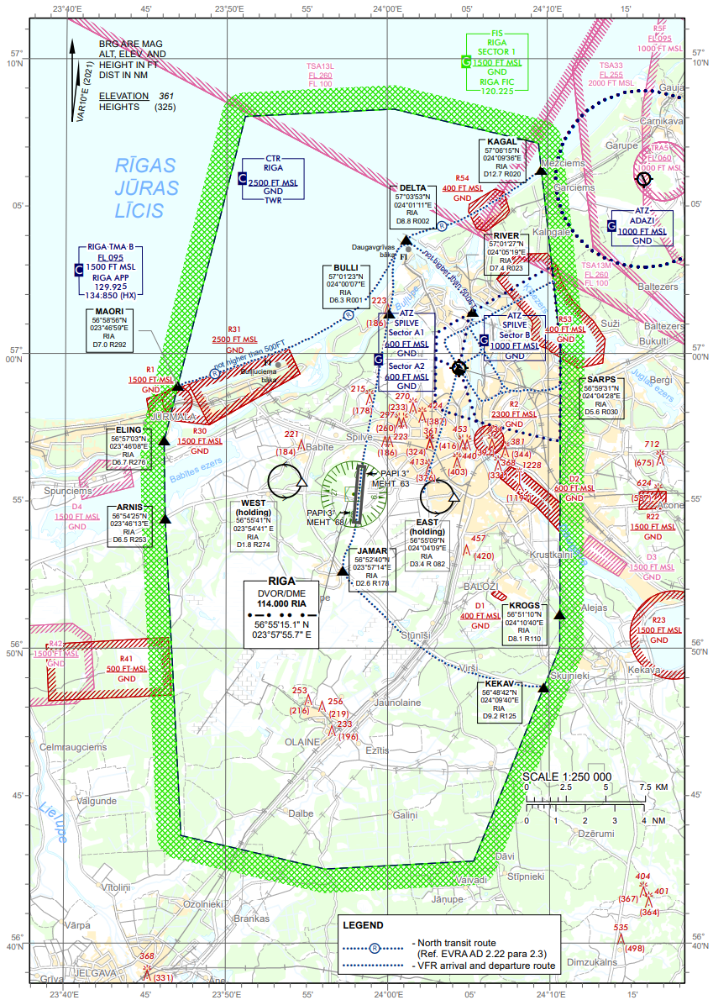

import { Callout } from "nextra/components";

# TWR SOP – Procedures

## Basic Procedures

### Airspace Overview

The AoR of Rīga Tower is defined by Riga CTR – a portion of controlled airspace lateral limits defined in Republic of Latvia AIP [EVRA AD 2.17.1](https://ais.lgs.lv). and vertical limits of SFC-2500FT AMSL. Riga CTR is designated as class C controlled airspace. For the purposes of this Knowledgebase as well as on frequency, Riga CTR will always be referred to as simply "controlled airspace". A graphical representation of Riga CTR is shown below.

  

<em>Source: Latvijas Gaisa Satiksme; AIP EVRA AD 2.24.14 - 1</em>

Riga CTR contains 2 airports within its lateral limits: RIX Riga Airport and Spilve Airfield with the former being the primary responsibility of Rīga Tower and the latter being uncontrolled. Parts of Riga CTR are designated as permanently restricted airspace. No traffic is permitted to enter these sections of airspace barring emergency situations. Rīga Tower ir primarily responsible for ensuring non-infringement of those areas by VFR traffic in its AoR. Below is an exhaustive table of permanently restricted airspace in Riga CTR with their respective vertical limits; lateral limits of prohibited, restricted, and danger areas are referenced in Republic of Latvia AIP [ENR 5.1](https://ais.lgs.lv).

|      Name      | Vertical Limits | Remarks |
| :------------: | :-------------: | :-----: |
|  EVR1 JURMALA  |   SFC-1500FT    |   NIL   |
|   EVR2 RIGA    |   SFC-2300FT    |   NIL   |
| EVR30 JURMALA1 |   SFC-1500FT    |   NIL   |
| EVR31 JURMALA2 |   SFC-2500FT    |   NIL   |
| EVR53 KISEZERS |    SFC-400FT    |   NIL   |
|  EVR54 VECAKI  |    SFC-400FT    |   NIL   |

Riga CTR also contains non-permanent danger areas. Pilots are expected to avoid those areas and ATC is expected to assist pilots in doing so. Below is an exhaustive table of danger areas in Riga CTR with their respective vertical limits; lateral limits of prohibited, restricted, and danger areas are referenced in Republic of Latvia AIP [ENR 5.1](https://ais.lgs.lv).

|    Name     | Vertical Limits |                                                       Remarks                                                        |
| :---------: | :-------------: | :------------------------------------------------------------------------------------------------------------------: |
| EVD1 BALOZI |    SFC-400FT    |                             Danger area. Active from local SR to SS due to UAV flights.                              |
| EVD2 KRASTA |    SFC-600FT    | Danger area. Active 01 APR till 30 NOV from local SR to SS due to non-radio equipped powered hang glider activities. |

Although birds are not simulated on the VATSIM Network, information about their migration is available in Republic of Latvia AIP [EVRA AD 2.23.1](https://ais.lgs.lv). Bird migration may affect runway operations from March to May and from August to October. Notice of bird activity in the vicinity of the aerodrome is included in the ATIS from 01 MAY until 30 SEP.

### Combined GMC Operations

It is often the case that the traffic load on RIX Riga Airport is light enough not to warrant a separate GMC ATS unit. In such circumstances GMC operations shall be combined with TWR as a single ATS unit and the following message shall be included in the ATIS:

  > Ground control is combined with tower on 118.105.

Unlike in the real world, on VATSIM permanent staffing cannot be ensured and thus the Network employs a so-called "top-down" principle for online ATS units. Barring extreme traffic load, higher ATS units shall cover those below as a single ATS unit. It is further important to note that since the procedure of combining GMC and TWR operations is present in real life, it must be carried out on VATSIM in the same way as it is in the real world, i.e. by including the above message in the current ATIS.

### Selection of Runway-in-use

The duty of selecting the runway-in-use is a joint responsibility of Rīga Tower and Rīga Approach.

The main method of determining the runway-in-use is based on surface wind. The current METAR always contains that information in the following format: `35011KT`. This contains the direction of the wind (350 degrees in this case) and its speed (11 knots). If the wind direction is closer to 360 degrees (from 270 degrees to 089 degrees), runway 36 shall be selected; otherwise, if the wind direction is closer to 180 degrees (from 090 degrees to 269 degrees), runway 18 shall be selected.

The following factors can be also taken into consideration when selecting the runway in use:

- approach and landing facilities serviceability;
- meteorological conditions (RVR);
- reported or forecast wind shear, or when thunderstorms are expected to affect the approach or departure;
- air traffic flow/direction;
- preferential runway system.

A runway-in-use direction with a tail wind component, including gusts, not exceeding 5 kt can be assigned, when:

- air traffic flow expected to runway direction;
- the crosswind component, including gusts, does not exceed 15 kt and/or;
- the runway condition is not worse than "WET" and braking action is not worse than "GOOD" and;
- braking action is not adversely affected by runway contaminants such as ice, slush, snow, frost and water.

The preferential runway system is applied as follows (time given in Rīga local timezone):

|              | <strong className="font-bold">00:00 to 17:59</strong> | <strong className="font-bold">18:00 to 23:59</strong> |
| :----------: | :---------------------------------------------------: | :---------------------------------------------------: |
| **TAKE OFF** |                         18/36                         |                         18/36                         |
| **LANDING**  |                         18/36                         |                          36                           |

### Runway Operations – Departures

#### Takeoff Clearances

Departing aircraft approaching the runway-in-use shall be issued a takeoff clearance as soon as reasonably practicable. For a takeoff clearance to be issued, all of the following conditions must be met:

- the departing aircraft's crew are ready for departure;
- the runway is clear and there is no traffic overflying the runway below 2500FT AMSL;
- preceding departing traffic (if any) must have crossed the reciprocal runway threshold and/or started a turn and left the runway track;
- preceding arriving traffic (if any) must have vacated the runway and crossed the runway holding point (stop bars) in full;
- succeeding arriving traffic (if any) must not be closer than 5 NM DME from the runway-in-use threshold.

Generally, an assumption is made that aircraft approaching the runway holding point are ready for departure unless the crew explicitly notifies ATC otherwise.

A takeoff clearance must contain all of the following items in the order given.

1. Current runway surface wind.
2. The runway for which the clearance is issued.
3. The phrase "cleared for takeoff".
4. A symbolic reminder about the automatic handoff procedure, such as "bye-bye". A further explanation for this item is provided in [the next section of this SOP](#transfer-of-control-and-communications-departures).

<Callout type="error" emoji="⚠️">
  The noun "**takeoff**" is defined as a permanent keyword. It must be used
  exclusively in takeoff clearances and never in any other
  clearances/instructions.
</Callout>

#### Line-up Clearances

In cases when the runway-in-use threshold (or area in front of a given intersection) is clear, though a takeoff clearance cannot be issued for any reason, a line-up clearance can be used to streamline runway operations. A line up clearance must include the instruction to "line-up and wait" as well as the runway-in-use.

Line-up clearances may be issued conditionally in cases when the clearance can be optimised for a preceding departure or arrival. A conditional line-up clearance must include visually identifiable information about the preceding aircraft: airline (if possible) and aircraft type.

#### Transfer of Control and Communications (Departures)

RIX Riga Airport employs an automatic handoff procedure for IFR departures. All IFR departures are expected to contact Rīga Approach on frequency 129.925 MHz before passing 1500FT AMSL or as soon as reasonably practicable.

As part of an ongoing effort to enforce the application of this procedure on the VATSIM Network, pilots are always symbolically reminded about it in their takeoff clearance by use of the phrase "bye-bye" or a suitable alternative. In situations when the B sector of Riga TMA is staffed as a separate ATS unit or the departure frequency is not 129.925 MHz for any other reason, the symbolic reminder shall be replaced with a "when airborne, contact" clause.

For all IFR departures, Rīga Tower relinquishes authority, yet retains control the moment a takeoff clearance is read back. Transfer of control and transfer of communications of IFR departures happens simultaneously once the crew switches their radios th the departure frequency.

The automatic handoff procedure does not apply to VFR departures. For further details see the [VFR Procedures](#vfr-procedures) section.

### Runway Operations – Arrivals

#### Landing Clearances

Arriving aircraft on final approach and in contact with Rīga Tower shall be issued a landing clearance as soon as reasonably practicable. For a landing clearance to be issued, all of the following conditions must be met:

- the runway is clear and there are no aircraft overflying the runway below 2500ft AMSL;
- preceding departing traffic (if any) must have crossed the reciprocal runway threshold and/or started a turn and left the runway track;
- preceding arriving traffic (if any) must have vacated the runway and crossed the runway holding point in full;

A landing clearance must contain all of the following items in the order given.

1. Current runway surface wind.
2. In cases when current reported RVR is ≤ 6000 meters it must be included in the landing clearance.
3. The runway for which the clearance is issued.
4. The phrase "cleared to land".

<Callout type="error" emoji="⚠️">
  The verb "**to land**" and all its derivatives are defined as permanent
  keywords. They must be used exclusively in landing clearances and never in any
  other clearances/instructions.
</Callout>

#### "Continue Approach" Instructions

In cases when a landing clearance cannot be issued arriving traffic on final approach shall be instructed to continue their approach. The "continue approach" instruction must contain all of the following items in the order given.

1. The word "continue".
2. The full approach type assigned to the aircraft.
3. The runway for which the instruction is issued.

In periods of High Intensity Runway Operations (HIRO) a wind check may be provided as well in order to omit it from the final landing clearance.

<Callout type="error" emoji="⚠️">
  In cases when an inbound aircraft has not been issued a landing clearance
  beyond 4 NM DME, a notification to expect a late landing clearance shall be
  issued.
</Callout>

#### Missed Approach Procedures

In cases when adequate safety buffers and conditions are not met for an aircraft to land, either the crew or the TWR ATCO may invoke the missed approach procedure. The standard instructions following a missed approach at RIX Riga Airport are for the aircraft to climb on RWY track to 2500 FT AMSL and expect radar vectors. Although this procedure is standardised and published in many instances across the Republic of Latvia AIP (including approach charts), it must be reiterated to the crew regardless of which side has invoked the missed approach procedure.

Rīga Tower reserves the right to alter the standard missed approach procedure by issuing a single vector to the aircraft in question in order to provide timely separation or otherwise ensure safe and efficient operations. All missed approaches must be coordinated with APS by notification with the reason for the invocation of the procedure clearly communicated.

#### Transfer of Control and Communications (Arrivals)

In theory there is an automatic handoff procedure in place for all arrivals just like there is for IFR departures, however in practice most pilots would not expect this to be the case as this is a fairly unique procedure. Therefore, following real-life practice, it is recommended that having vacated the runway, arriving traffic should receive a handoff to Rīga GMC (when staffed separately). Should Rīga Ground not be staffed, arrivals remain under TWR control. Transfer of control happens simultaneously with the transfer of communications.

### VFR Procedures

VFR operations may only be conducted if the cloud ceiling is at or above 1500FT and RVR is ≥ 4000 meters.

Rīga Tower reserves the right to refuse any VFR aircraft's request for operational and/or safety reasons. It is strongly recommended that VFR pilots be provided with alternative solutions of achieving their routing intentions without causing unreasonable delays.

<Callout type="error" emoji="⚠️">
  On frequency Riga CTR must always be referred to as "controlled airspace".
</Callout>

#### Departure Clearances

VFR departures may be initially cleared for 2 types of departure: **aerodrome visual circuit** or a **directional VFR departure**. Such clearances can be issued directly to the requesting pilot or relayed through the GMC ATCO should one be present.

##### Aerodrome Visual Circuit

<em>Source: Latvijas Gaisa Satiksme; AIP EVRA AD 2.20.16. Figure 1.</em>

The diagram above describes the vertical and lateral limits for the aerodrome visual circuit at Rīga. Should a pilot request to follow a visual circuit as part of their departure clearance request, the following departure instructions shall be issued by default:

1. `EASTBOUND` aerodrome visual circuit (left-hand circuit for RWY 18 and right-hand circuit for RWY 36).
2. Altitude restriction `NOT BELOW 1500FT`.

Should there be operational reasons (e.g. traffic flow) that impact the safety or practicality of assigning the aforementioned departure instructions, deviations from the default instructions are possible. Similarly, pilots' requests for non-standard departure instructions may be accommodated within reason.

<Callout type="error" emoji="⚠️">
  The altitude restriction within an aerodrome visual circuit **MUST NOT**
  exceed 2500FT.
</Callout>

<Callout type="error" emoji="⚠️">
  The distance between an aircraft in the aerodrome visual circuit and the
  runway centerline **MUST NOT** exceed 3 NM while on downwind (flying parallel
  to the runway centerline).
</Callout>

##### Directional VFR Departure

Alternatively to following an aerodrome visual circuit, a pilot may request depart the airfield. A departure request must always contain the requested direction and/or requested exit point (VRP). Should a pilot request to depart the airfield, the following departure instructions shall be issued by default:

1. Clearance to exit the controlled airspace including instructions on how the exit shall be performed. Said instructions must contain a valid exit point in the form of a VRP.
2. Altitude restriction `AT OR BELOW 1500FT`, unless exiting via SARPS, in that case altitude restriction `AT 1000FT` shall be used.

VFR traffic shall cross Riga CTR boundary via the following CTR entry/exit points: ARNIS, ELING, KROGS. VFR traffic heading towards Spilve ATZ may use exit point SAPRS (at 1000 ft). VFR traffic arriving from Spilve ATZ may use entry points SARPS (at 1000ft) and RIVER (at 500ft).

Should there be operational reasons (e.g. traffic flow) that impact the safety or practicality of assigning the aforementioned departure instructions, deviations from the default instructions are possible. Those deviations include, but are not limited to issuing a clearance for an exit point other than the one that was requested, modifying the default altitude restriction, etc. Pilots' requests shall be accommodated within the bounds of operational safety and reason.

<Callout type="error" emoji="⚠️">
  The altitude restriction for exiting the controlled airspace **MUST NOT**
  exceed 1500FT.
</Callout>

#### Takeoff Clearances

Takeoff clearances for VFR departures are issued in the same way as for IFR departures, however, instead of the expectation for the departing aircraft's crew to change their frequency after departure, VFR departures remain on TWR frequency and shall be instructed to "report airborne" as part of their takeoff clearance.

#### Interaction with Airborne Traffic

Airborne traffic, whether in a visual circuit or otherwise within Riga CTR is required to continuously report their position to ATC. All aircraft in a visual circuit must be instructed to report reaching the downwind leg of their circuit and regularly update ATC on their intentions. Depending on on the traffic situation, reporting of reaching the final leg of the circuit can also be required. Traffic present in Riga CTR for executing procedures other than a visual circuit (entry, exit, transit) shall report passing of VRPs on lateral borders of Riga CTR as well as overflight of or visual contact with any visual reference requested by ATC.

ATCOs are expected to maintain current information on the intentions of all traffic in their AoR. Currency of intentions can be established by prompting a given aircraft's crew to report them. Should it be required by safety or other operational reasons, Rīga Tower shall enforce non-interference of VFR traffic into the operations of higher priority traffic by issuing holding instructions (orbiting instructions over a given point) or extending a given aircraft's downwind leg of the visual circuit.

In class C and D airspaces (the only classes of controlled airspace present in EVRR FIR) ATC does not provide radar separation to VFR traffic. In place of radar separation VFR traffic is provided Flight Information Services (FIS) by their current ATS unit. FIS includes but is not limited to provision of current and accurate weather information and traffic information. Traffic information must be provided to aircraft under FIS in cases when lateral separation between 2 or more aircraft reduces below 5 NM and vertical separation reduces below 1500FT. If workload permits, traffic information should be provided both ways (i.e. to the aircraft under FIS and to the other traffic regardless of flight rule and other conditions). In cases when both aircraft concerned with traffic information are under FIS, traffic information must be provided to both aircraft.

As part of traffic information, the following information must be provided:

1. Airline (if possible) and aircraft type.
2. A clockwise direction.
3. Indicated altitude.

An approximate distance may also be provided as an assistive measure.

#### Crossing the Lateral Boundary of Riga CTR

##### Entry to Riga CTR

VFR traffic entering Riga CTR must report their intentions to Rīga Tower before receiving an entry clearance. Any entering traffic must be issued (or already have fulfilled) the following items/instructions as part of their entry clearance:

0. A valid squawk code (most aircraft already have one, hence this is numbered as item 0).
1. The phrase "cleared to enter the controlled airspace".
2. A valid entry point (VRP).
3. An altitude restriction.
4. Post-entry instructions (holding instructions or instructions to join a visual circuit).

If entering via SARPS, the altitude restriction shall be AT 1000FT; if entering via RIVER, the altitude restriction shall be NOT BELOW 500FT; otherwise, the altitude restriction is dictated by traffic flow, visual circuit rules, operational capacity, and other factors Rīga Tower deems concerning.

##### Exit from Riga CTR

Any traffic exiting Riga CTR must do so via a valid exit point (VRP). Upon overflight of said point, a "frequency change approved" instruction must be issued and, if available, a valid FIS frequency should be advised.

##### Transit of Riga CTR

A transit of the controlled airspace is a combination of entry and exit procedures. As part of a transit clearance, the following items must be provided in the order given.

1. The phrase "cleared to transit the controlled airspace".
2. A valid entry point (VRP).
3. A valid routing (must consist of visually identifiable elements, e.g. VRPs).
4. A valid exit point (VRP).
5. An altitude restriction and current QNH.

All aircraft transiting the controlled airspace must report overflight of their assigned entry and exit points. Additional reporting requirements may be imposed by Rīga Tower in cases of operational necessity.

An aircraft may transit the controlled airspace by either following the published North Transit Route or by requesting a custom routing. The North Transit Route is a published routing that exists between MAORI VRP (Majori neighbourhood in Jūrmala) and KAGAL VRP following the coast; all aircraft following the North Transit Route must be issued the altitude restriction to remain `AT OR BELOW 500FT`; aircraft following the North Transit Route **are not** a factor to either departing or arriving traffic and **do not** inhibit runway operations ar RIX Riga Airport.

Aircraft requesting custom transit routings shall make their request to Rīga Tower. Rīga Tower shall grant transit requests depending on the current traffic flow and operational capacity, but reserves the right to modify or replace the requested custom routing. Rīga Tower is expected to exercise caution and avoid causing delays in runway operations; should the aircraft's requested routing be unavailable for any reason, they can be assigned a different routing or instructed to hold over any holding point or VRP until their requested routing becomes available. If an aircraft waiting for their requested routing to become available is instructed to hold over a holding point or VRP inside the controlled airspace, a transit clearance must be issued with the holding instruction appended to it.

<Callout type="error" emoji="⚠️">
  Any aircraft overflying the runway at or below 2500FT AMSL inhibits any and
  all runway operations.
</Callout>

#### Inbound Runway Operations

Besides a full stop landing inbound traffic can also request a touch-and-go as well as a low pass. There is no practical difference between these actions for ATC besides a small phraseological change. Instead of the phrase "cleared to land", "cleared for touch-and-go" and "cleared for low pass" shall be used. Aircraft performing a touch-and-go shall be instructed to report airborne; aircraft performing a low pass shall be instructed to report overflight of reciprocal runway threshold.

#### Provision of service in Spilve ATZ (including EVRS)

Spilve Aerodrome Traffic Zone is a class G airspace and thus is uncontrolled. Rīga Tower retains the authority to use the VRPs inside Spilve ATZ for holding and routing purposes as well as clear for CTR exits and entries via Spilve ATZ.

Any traffic manoeuvring in Spilve ATZ should report said manoeuvres on a published CTAF frequency or on Rīga Information frequency (if available). Any traffic in Spilve ATZ has the right to flight information service provided by Rīga Tower.

Weather information for Spilve ATZ matches that of RIX Riga Airport.

#### Miscellaneous Published Routes in Riga CTR

There are 2 Special VFR (SVFR) arrival routes published that may be used for swift VFR handling without the use of a visual circuit. The routes are as follows:

- KAGAL – BULLI – straight-in-approach to runway 18 **OR** left-hand visual circuit, runway 36.
- KEKAV – JAMAR – straight-in-approach to runway 36 **OR** right-hand visual circuit, runway 18.

### Helicopter Procedures

Helicopter movement at Rīga is regulated by Republic of Latvia AIP [EVRA AD 2.16 and 2.20.10](https://ais.lgs.lv). Helicopters may take off both from the runway and from the helipad (next to stand 230). Special helicopter stands are available at Rīga – H01 and H02. **ALL** helicopter movement must be coordinated with and released by Rīga Tower. The following rules apply to all helicopters at Rīga:

- Any helicopter vacating the helipad must report “helipad vacated” or be asked to confirm this.
- Helicopters with skid undercarriage are to use all ground taxiways as air taxiways.
- All helicopters intending to air taxi should include the term “air taxi” in the taxi requests. If it is unclear, which type of taxi the pilot is requesting they shall be prompted to specify it.
- Wheeled helicopters shall not use helicopter stands for turning on the ground and may ground taxi for departure when pre-aligned on the respective lead-out line. Wheeled helicopters shall not touch down or lift off on aircraft stands 313, 314, 315, and 316.
- Helicopters landing on the helipad shall avoid, as far as practicable, overflying any other aircraft, de-icing pads, and all aprons except Apron 2. It is a joint duty of Rīga Ground and Rīga Tower to prevent violations of this rule.
- Simultaneous movement on the helipad and H01/H02 stands is NOT allowed.
- Simultaneous movement on the helipad and the runway is NOT allowed.
- Any traffic overflying RIX Riga Airport at or below 1500 ft is considered to be an obstruction to runway movements (this includes both helicopters and fixed-wing aircraft).

### Coordination

The following coordination is required at all times between Rīga Tower and neighbouring ATS units.

#### Notifications

| Recipient |                             Condition                              |           Remarks            |
| :-------: | :----------------------------------------------------------------: | :--------------------------: |
|    GMC    |                 A rejected takeoff (RTO) occurred                  |             NIL              |
|    APS    |               Any type of non-standard IFR departure               | Including J SIDs from RWY 36 |
|    APS    |           A missed approach procedure has been initiated           | Reason must be communicated  |
|    APS    | Insufficient arrival spacing to accommodate current departure flow |             NIL              |

#### Requests for Release

| Recipient |                                     Condition                                     |                                  Expected Response                                   | Remarks |
| :-------: | :-------------------------------------------------------------------------------: | :----------------------------------------------------------------------------------: | :-----: |
|    APS    | An aircraft is ready to depart from a runway other than the current runway-in-use | Approval of the request (or expected delay) and any additional relevant instructions |   NIL   |

## Advanced Procedures

### Low Visibility Procedures and CAT II Approaches

When LVP are effected the following restrictions apply:

- Runway 18/36 is only approved for manoeuvres when RVR is greater or equal to 250 meters. This means that with RVR less than 250 meters, no runway operations may be authorised, and traffic movement shall be halted until visibility conditions improve.
- In order to maintain protection of the ILS, no vehicle or aircraft shall penetrate/infringe ILS critical and sensitive areas. In order to fulfil this requirement, more than 8 NM spacing between arrivals will be used.

CAT II approaches (both simulated and during real LVP) make no difference for Rīga Tower operations, however, 8 NM arrival spacing must be observed. Runway 18/36 is equipped with CAT II holding points at taxiways A, B, E, and G. A and G should be prioritised; B and/or E should only be used when A and/or G are not available.

Further reading on LVP and CAT II approaches, see Republic of Latvia AIP [EVRA AD 2.22.3 and 2.22.4](https://ais.lgs.lv).

### Approach Types

| Approach Type | Relevant frequency, inbound track, glide path slope, final length                                                                                                  |                                      Remarks                                      |
| :-----------: | :----------------------------------------------------------------------------------------------------------------------------------------------------------------- | :-------------------------------------------------------------------------------: |
|  ILS Y/LOC Y  | **RWY 36**: 108.100 MHz / 355° / GP 3.0° / 10 NM (6.5 NM for short approach)  **RWY 18**: 111.100 MHz / 175° / GP 3.0° / 10 NM (6.5 NM for short approach) |                     Default type of approach, RNAV 1 required                     |
|  ILS Z/LOC Z  | **RWY 36**: 108.100 MHz / 355° / GP 3.0° / 10 NM (6.5 NM for short approach)  **RWY 18**: 111.100 MHz / 175° / GP 3.0° / 10 NM (6.5 NM for short approach) |                  Intended for aircraft not equipped with RNAV 1                   |
| RNAV (RNP) Y  | **RWY 36**: NIL / 355° / GP 3.0° / 10 NM (6.5 NM for short approach)  **RWY 18**: NIL / 175° / GP 3.0° / 10 NM (6.5 NM for short approach)                 |                                  RNAV 1 required                                  |
| RNAV (RNP) Z  | **RWY 36**: NIL / 355° / GP 3.0° / 3.2 NM  **RWY 18**: NIL / 175° / GP 3.0° / 2.9 NM                                                                       |                          Special authorisation required                           |
|      VOR      | **RWY 36**: RIA DVOR 114.000 MHz / 351° / GP 2.98° / 11.9 NM  **RWY 18**: RIA DVOR 114.000 MHz / 179° / GP 2.98° / 12 NM                                   |            Full racetrack procedure and straight in approach available            |
|    Visual     | **RWY 36**: NIL / NIL / NIL / 6.5 NM  **RWY 18**: NIL / NIL / NIL / 6.5 NM                                                                                 | May only be used if cloud ceiling is at or above 1500FT and RVR is ≥ 4000 meters. |

### Separation and Sequencing

Separation in Riga CTR as well as sequencing on runway holding points is ensured by means of applying defined priority rules. Furthermore, sequencing is generally managed by use of conditional clearances and holding instructions when necessary. A few informal pieces of advice for ensuring smooth operations are presented below.

- There should be no more than 2 aircraft on the same holding point (B, C, E taxiways) and no more than 5 aircraft on the same holding point (A and G taxiways).
- The departure sequence from different holding points should be alternating.
- Departure priority is inversely proportional to the WTC of the aircraft.
- Application of priority rules to arriving traffic is the responsibility of APS except for VFR traffic.
- Continuous coordination leads to easier sequencing.
- A sequence plan made in advance that includes all aircraft involved is half of the work required to solve a given traffic situation.

### Reduced Runway Separation Minima

In accordance with Republic of Latvia AIP [EVRA AD 2.20.5.3](https://ais.lgs.lv), reduced runway separation minima shall be applied during the hours of daylight from 30 minutes after local sunrise to 30 minutes before local sunset. This procedure allows for non-precise departure and arrival intervals.

Under reduced runway separation minima the aircraft are divided into 3 categories.

- **Category 1** aircraft: single-engine propeller aircraft with a maximum certificated take-off mass of 2000 kg or less.
- **Category 2** aircraft: single-engine propeller aircraft with a maximum certificated take-off mass of more than 2000 kg but less than 7000 kg; and twin-engine propeller aircraft with a maximum certificated take-off mass of less than 7000 kg.
- **Category 3** aircraft: all other aircraft.

Reduced runway separation minima shall be applied with the following restrictions.

- Wake turbulence separation minima shall be applied (see ICAO WTC separation minima featured later in this section of the Knowledgebase).
- Visibility shall be at least 5000 meters and ceiling shall not be lower than 1000FT (those conditions also allow for multiple line-ups in accordance with Republic of Latvia AIP [EVRA AD 2.20.6](https://ais.lgs.lv))
- Tailwind component shall not exceed 5 KT.
- The runway condition shall not be worse than "wet" and braking action shall not be worse than "GOOD", and braking action shall not be adversely affected by runway contaminants such as ice, slush, snow, frost and water.
- The use of conditional clearances for line-ups is mandatory.
- Reduced runway separation minima shall only apply between succeeding and preceding arriving aircraft. It shall **NOT** apply between a departing aircraft and a preceding arriving aircraft.

Regardless of any other factors, in accordance with Republic of Latvia AIP [EVRA AD 2.20.5.3.5](https://ais.lgs.lv) established separation shall be as follows.

- A succeeding landing Category 1 aircraft may cross the runway-in-use threshold when a preceding Category 1 or 2 aircraft has landed and has passed a point at least 600 meters from the threshold of the runway-in-use, is in motion, and will vacate the runway without backtracking.
- A succeeding landing Category 2 aircraft may cross the runway-in-use threshold when a preceding Category 1 or 2 aircraft has landed and has passed a point at least 1500 m from the threshold of the runway-in-use, is in motion, and will vacate the runway without backtracking.
- A succeeding landing aircraft may cross the runway-in-use threshold when a preceding Category 3 aircraft has landed and has passed a point at least 2400 m from the threshold of the runway-in-use, is in motion, and will vacate the runway without backtracking.

Ensuring separation between arrivals is the duty of Rīga Approach, however, Rīga Tower must preserve that separation by use of imprecise speed restrictions or use go-around instructions if a loss of separation is imminent or unavoidable. Departure separation is a joint duty of Rīga Tower and Rīga Approach; the separation minima in this case may be time based or distance based. Time-based separation applies only during LVP or for non-RNAV equipped aircraft (as well as to succeeding and preceding aircraft to a non-RNAV equipped aircraft). Time-based separation is based on departure direction and is defined in the table below.

|             Condition             | Minimum Separation (MIN) |
| :-------------------------------: | :----------------------: |
| different SID/departure direction |            2             |
|   same SID/departure direction    |            3             |

Distance-based separation is applied by differential between WTCs and only applies to RNAV-equipped/PBN-capable aircraft when LVP are not effected. WTCs and distance-based separation are described in the tables below.

| Wake Turbulence Category (Designator) |                              Description                              |
| :-----------------------------------: | :-------------------------------------------------------------------: |
|               Light (L)               |                            MTOW ≤ 7000 kg                             |
|              Medium (M)               |                      7000 kg < MTOW ≤ 136000 kg                       |
|               Heavy (H)               | MTOW > 136 000 kg (except Super aircraft as defined in ICAO Doc 8643) |
|               Super (J)               |      aircraft specified in ICAO Doc 8643 (only Airbus A380-800)       |

RIX Riga Airport is capable of providing service to all aircraft except for those in the Super (J) wake turbulence category. Information about the Super (J) wake turbulence category is included in this SOP for the sake of completeness.

| Succeeding Aircraft WTC | Preceding Aircraft WTC | Separation Minima (NM) |
| :---------------------: | :--------------------: | :--------------------: |
|          Light          |         Medium         |           5            |
|          Heavy          |    Heavy (and B757)    |           4            |
|         Medium          |    Heavy (and B757)    |           5            |
|          Light          |    Heavy (and B757)    |           6            |
|          Heavy          |         Super          |           6            |
|         Medium          |         Super          |           7            |
|          Light          |         Super          |           8            |

### Workload Management and Safety

The basis of maintaining safe and efficient operations lies in application of priority rules and avoidance of frequency congestion. Controllers seeking to master this aspect of their work shall follow the advice provided in this section of the Knowledgebase.

- Instructions issued by ATC shall be as concise as possible.
- ATC shall keep track of all aircraft on their frequency (that includes maintaining a queue of requests and going through it).
- Aircraft shall be instructed to stand by as to not inhibit operations of higher priority traffic.
- Aircraft in the air have priority over aircraft on the ground (arrivals have priority over departures).
- IFR traffic has priority over VFR traffic.
- Aircraft shall be prioritised based on the minimum possible delay doctrine.
- Occupation of the runway-in-use as well as the extended runway centreline must be kept to a minimum.
